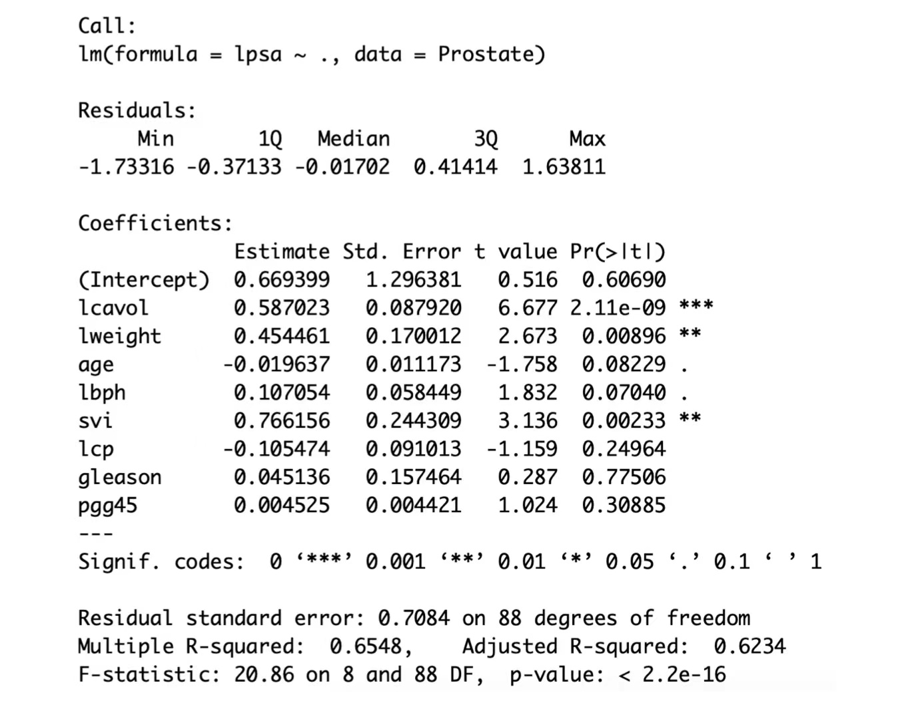
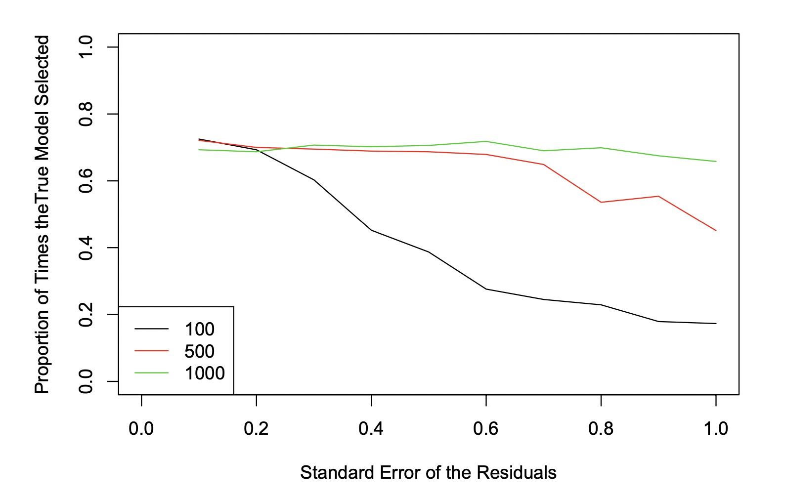

```{r setup, include=FALSE}
knitr::opts_chunk$set(echo = TRUE)
library(broom)
```

## Part 1: Exploring Various Models (8 points)

1. Model height growth from age 2 to age 9 by answering the following questions:  
(a) Create a scatter plot of heights at age 9 on heights at age 2, with the points colored based on the gender of the child. Does there appear to be a different pattern for boys than for girls?  
**Answer:** With the scatter plot of heights at age 9 on heights at age 2, colored by gender, I cannot tell there is a difference between pattern in boys data and girls data.
```{r}
# part 1 1(a)
df1 <- read.csv('BGS.csv')
df1$Sex <- factor(df1$Sex)
library(ggplot2)
ggplot(df1,aes(HT2,HT9,color=Sex))+geom_point()
```

```{r}
X <- matrix(c(rep(1,136),df1$HT2), nrow=136, ncol=2, byrow=F)
HT9 <- matrix(df1$HT9)
beta <- solve(t(X) %*% X) %*% t(X) %*% HT9
se <- sqrt((t(HT9-X%*%beta)%*%(HT9-X%*%beta)/(136-1-1))
           %*%diag(solve(t(X)%*%X)))
```
(b) Fit a simple linear regression of heights at age 9 on heights at age 2.  
  
  • Report and interpret the estimated regression coefficients.  
**Answer:** The intercept of the regression model is `r beta[1,]`, which is the estimated height at age 9 of a child whose height at age 2 was 0. The regression coefficient is `r beta[2,]`, which indicates that each 1 cm higher in a child's height at age 2 there would be `r beta[2,]` higher in his/her estimated height at age 9.  

  • Test the hypothesis of $H_0$: $\beta_1 = 0$ against the two-sided alternative.  
```{r}
t1 <- (beta[2,]-0)/se[,2]
print(paste0('The test statistic of the t test for beta1 is: ', t1))
pvalue_t1 <- 2*pt(t1,df=134,lower.tail = F)
print(paste0('The p-value of the two-sided test is: ', pvalue_t1))
```
**Answer: **The p-value is less than a 0.05 significance level, as a result I reject the null hypothesis.  
  • Show numerically that the value of the T-statistic for the above hypothesis test is equal to the square root of the F-statistic from the ANOVA at the bottom of the regression output.  
```{r}
fit1 <- lm(HT9~HT2,data=df1)
# check whether T-statistic is equal to the square root of the F-statistics from anova
cat(paste0('The T-statistic is ',round(t1,5)), 
    paste0('The sqrt of the F-statistic is ',
           round(sqrt(anova(fit1)[1,4]),5)), 
sep='\n')
```
**Answer: ** I have checked that they are equal.  
  • Check the normality and homoscedasticity assumptions on the residuals. Include any plots you consult.  
**Answer: ** The residuals vs fitted values plot is to test the homoscedasticity assumption. We can see that the residuals are approximately distributed around 0 with a constant variance, I would say the homoscedasticity assumption holds. The Q-Q plot is to check the normality assumption, there is only a few points at the two tails are off the Q-Q line. This indicates that the normality assumption is not violated.

```{r}
plot(fit1,which=1)
plot(fit1,which=2)
```

(c) Considering a model that allows for separate intercepts for boys and girls, is this model better than the simple linear regression fit above?  

```{r}
# (c)
fit2 <- lm(HT9~Sex+HT2,data=df1)
cat(paste0('The Adjusted R-sauqred of the simpler model is ',
       summary(fit1)$adj.r.squared,'.'),
paste0('The Adjusted R-sauqred of this model is ', 
       summary(fit2)$adj.r.squared, '.'),
paste0('The AIC of the simpler model is ',AIC(fit1),'.'),
paste0('The AIC of this model is ', AIC(fit2), '.'),
paste0('The BIC of the simpler model is ',BIC(fit1),'.'),
paste0('The BIC of this model is ', BIC(fit2), '.'), sep="\n")
```

**Answer: ** The model with separate intercept for boys and girls are not better than the simpler linear regression fit since the Sex indicator is not significant and the model has a smaller adjusted R-squared, larger AIC  and BIC than the simpler model. These two criteria prefer the simpler model.

(d) Considering a model that allows for both the separate slope and separate intercepts for boys and for girls, is this model better than the simple linear regression fit above?  

```{r}
# (d)
fit3 <- lm(HT9~Sex*HT2,data=df1)
cat(paste0('The Adjusted R-sauqred of the simpler model is ',
       summary(fit1)$adj.r.squared,'.'),
paste0('The Adjusted R-sauqred of this model is ', 
       summary(fit3)$adj.r.squared, '.'),
paste0('The AIC of the simpler model is ',AIC(fit1),'.'),
paste0('The AIC of this model is ', AIC(fit3), '.'),
paste0('The BIC of the simpler model is ',BIC(fit1),'.'),
paste0('The BIC of this model is ', BIC(fit3), '.'), sep="\n")
```

**Answer: ** The model that allows for both the separate slope and intercepts for boys and girls has a smaller adjusted R-squared, larger AIC and BIC than the simpler model, so we still prefer the simpler model.  

2. Model height growth from age 9 to age 18 by answering the following questions:  
(a) Create a scatter plot of heights at age 18 on heights at age 9, with the points colored based on the gender of the child. Does there appear to be a different pattern for boys than for girls?  

```{r}
# 2.(a)
ggplot(df1,aes(HT9,HT18,color=Sex)) + geom_point()
```

**Answer: **It appears a different pattern for boys than girls. Boys are higher at age 18 than girls.  
(b) Fit a simple linear regression of heights at age 18 on heights at age 9. Report the estimated regression coefficients.  

```{r}
# (b)
fit4 <- lm(HT18~HT9,df1)
cat(paste0('The intercept of the simple linear regression is ', coef(fit4)[1]),
    paste0('The coefficient on HT9 is ',coef(fit4)[2]),
    sep='\n')
```

(c) Considering a model that allows for separate intercepts for boys and girls, is this model better than the simple linear regression fit above?  
```{r}
# (c)
fit5 <- lm(HT18~HT9 + Sex, df1)
cat(paste0('The Adjusted R-sauqred of the simpler model is ',
       summary(fit4)$adj.r.squared,'.'),
paste0('The Adjusted R-sauqred of this model is ', 
       summary(fit5)$adj.r.squared, '.'),
paste0('The AIC of the simpler model is ',AIC(fit4),'.'),
paste0('The AIC of this model is ', AIC(fit5), '.'),
paste0('The BIC of the simpler model is ',BIC(fit4),'.'),
paste0('The BIC of this model is ', BIC(fit5), '.'),
sep='\n')
```

**Answer: ** The model with separate intercepts for boys and girls has larger adjusted R-squared, smaller AIC and BIC than the simpler model, as a result it is better than the simpler model.  
(d) Considering a model that allows for both the separate slope and separate intercepts for boys and for girls, is this model better than the simple linear regression fit above?  
```{r}
fit6 <- lm(HT18~HT9*Sex, df1)
cat(paste0('The Adjusted R-sauqred of the simpler model is ',
       summary(fit4)$adj.r.squared,'.'),
paste0('The Adjusted R-sauqred of this model is ', 
       summary(fit6)$adj.r.squared, '.'),
paste0('The AIC of the simpler model is ',AIC(fit4),'.'),
paste0('The AIC of this model is ', AIC(fit6), '.'),
paste0('The BIC of the simpler model is ',BIC(fit4),'.'),
paste0('The BIC of this model is ', BIC(fit6), '.'),
sep='\n')
```

**Answer: **The model with both separate slope and intercepts for boys and girls has larger adjusted R-squared, smaller AIC and BIC than the simpler model, as a result it is better than the simpler model.  
(e) Choose which of the above 3 models you think best describes the data and interpret the parameter estimates for this model.  
  
```{r}
coef(fit6)
```
**Answer: **I prefer the model with separate slope and intercepts for boys and girls since it has the smallest AIC and largest adjusted R-squared of the three. The intercept is `r coef(fit6)[1]`, which indicates the height of a boy at age 18 whose height is 0 at age 9. For girls, with each 1cm higher in heights at age 9, their heights at age 18 would be `r coef(fit6)[2]`cm higher. For boys, with each 1cm higher in heights at age 9, their heights at age 18 would be `r coef(fit6)[2]+coef(fit6)[4]`cm higher. With same height at age 9, the average height of boys at age 18 is `r coef(fit6)[3]`cm higher than the average height of girls.  
3. Create a new dataset that includes only the boys in the sample. Use this new dataset to model the change in weight from age 9 to age 18.  
```{r}
df2 <- df1[df1$Sex==0,]
```

(a) Fit two linear regression models: (M1) Weight at age 18 on weight at age 9 and (M2) Weight at age 18 on weight at age 9 and leg circumference at age 9. Explain why weight at age 9 is significant in one model but not the other. Justify your answer by calculating the appropriate correlation coefficient.  
```{r}
M1 <- lm(WT18~WT9,df2)
M2 <- lm(WT18~WT9+LG9,df2)
cor(df2$WT9,df2$LG9)
```
**Answer: **The correlation of height at age 9 and leg circumference at age 9 is around 0.94, which indicates that they are highly correlated. That is saying, there is an issue of collinearity in M2, which reduces the significance of both variables in M2.  

(b) The hat matrix can be calculated as $H = X(X^TX)^{-1}X^T$ , where X is the design matrix. The diagonal values of the hat matrix determine the leverage that each point has in the fit of the regression model.  

  • Explain why this matrix is known as the hat matrix. (You may need to do some research to answer this question).  
**Answer: **The matrix is know as the hat matrix because it maps the vector of observed values into a vector of fitted values. That is, $\hat{y}=X(X^TX)^{-1}X^Ty=Hy$  (Meloun & Militký, 2011)  
  • Calculate this matrix in `R` using the design matrix corresponding to this set of questions. Show that the leverage of one of the points is much higher than any of the other points.  
```{r}
X <- matrix(c(rep(1,66),df2$WT9), nrow=66, ncol=2, byrow=F)
H <- X %*% solve(t(X)%*%X) %*% t(X)
hist(diag(H))
```

**Answer: ** I make a histogram of the diagnol of the hat matrix and there is one point of data on the histogram that has a leverage much higher tan any other points.  
  • Fit two simple linear regression models, both regressing weight at age 18 on weight at age 9. One model should use all of the boys in the dataset, and the other should remove the high-leverage point. Compare the coefficients for weight at age 9 obtained from both models.  
```{r}
leverage.point <- which.max(diag(H))
fit_allboys <- lm(WT18~WT9,data = df2)
fit_noleverage <- lm(WT18~WT9,data=df2[-leverage.point,])
coef(fit_allboys)
coef(fit_noleverage)
```

**Answer: **After removing the leverage point from the dataset, the coefficient of the height at age 9 decreases.  
  • Create a scatter plot of weight at age 18 on weight at age 9. Plot both regression lines fit in the previous part on the plot in different colors.  
```{r}
plot(df2$WT18~df2$WT9,pch=16, xlab='weights at age 9', ylab='weights at age 18')
abline(fit_allboys,col='red')
abline(fit_noleverage,col='blue')
legend(122, 195, legend=c("All boys", "No leverage"),
       col=c("red", "blue"), lty=1)
```

  • Based on the above parts, which regression line you think better fits the data? Report and interpret the estimated regression parameters for the model you choose.  

```{r}
summary(fit_allboys)
summary(fit_noleverage)
```

**Answer: **I think the the regression line removed high-leverage better fits the data since more points are consistent to the regression line in general. The intercept and coefficient of height at age 9 are `r coef(fit_noleverage)[1]` and `r coef(fit_noleverage)[2]` respectively. The intercept indicates the average height of a boy at age 18 whose height at age 9 is 0. The coefficient of height at age 9 represents that each cm higher in one's height at age 9, his height at age 18 would be `r coef(fit_noleverage)[2]` higher.
  
4. Create a new dataset that includes only the girls in the sample. Use this new dataset to model Somatotype in the following ways.  
```{r}
df3 <- df1[df1$Sex==1,]
```

(a) Plot somatotype against weight at each of the three time points. Comment on how the relationship between weight and somatotype changes over time.  
```{r, fig.cap='somatotype against weight at each of the threes time points'}

plot(df3$Soma ~ df3$WT2,pch=16,xlab='weights at age 2, 9, 18',ylab='Somatotype',
     xlim=c(0,105),cex=.5)
points(df3$Soma ~ df3$WT9,pch=16,col='red',cex=.5)
points(df3$Soma ~ df3$WT18,pch=16,col='blue',cex=.5)
legend(90, 4, legend=c("age 2", "age 9", 'age 18'),
       col=c('black',"red", "blue"), pch=16,cex=.5)
```
  
**Answer: **I try to plot the data at different ages so the difference in patterns is more obvious. On the plot we can observe a steeper trend in the pattern of the older age group. In other words, in the older age group the somatotype and weights are more positively correlated.  
\newpage

(b) Create new variables:  
$$DW9 = WT9 - WT2$$
$$DW18 = WT18 - WT9$$ 
$$AVE = \frac{1}{3}(WT2+WT9+WT18)$$
$$LIN =WT18-WT2$$
$$QUAD = WT2 - 2WT9 + WT18$$
DW9 and DW18 measure the change in weight between consecutive timepoints. AVE, LIN, and QUAD measure the average, linear and quadratic trends over time (since the timepoints are roughly evenly spaced).  
```{r}
df3$DW9 = df3$WT9 - df3$WT2
df3$DW18 = df3$WT18 - df3$WT9
df3$AVE = (df3$WT2 + df3$WT9 + df3$WT18)/3
df3$LIN = df3$WT18 - df3$WT2
df3$QUAD = df3$WT2 - 2*df3$WT9 + df3$WT18
```

  (c) Fit the following three models:  
$$M1 : Somatotype \sim WT2 + WT9 + WT18$$
$$M2 : Somatotype \sim WT2 + DW9 + DW18$$
$$M3 : Somatotype \sim AVE + LIN + QUAD$$
```{r}
Q4_M1 <- lm(Soma ~ WT2 + WT9 + WT18, df3)
Q4_M2 <- lm(Soma ~ WT2 + DW9 + DW18, df3)
Q4_M3 <- lm(Soma ~ AVE + LIN + QUAD, df3)
coef(Q4_M1)
coef(Q4_M2)
coef(Q4_M3)
```
Compare and contrast these models by answering the following questions:  
  • What attributes of the models are the same across all three models? What attributes of the models are different?  
**Answer: **The intercept of the three models; and coefficients of WT18 and DW18; and the coefficients of WT2 and AVE are the same. The other attributes are all different.  
  • Why does the coefficient for DW18 in model 2 equal the coefficient for WT18 in model 1, but the coefficient for DW9 in model 2 does not equal the coefficient for WT9 in model 1?  
**Answer: **  
Since $$M2 : Somatotype \sim WT2 + DW9 + DW18$$
$$DW9 = WT9 - WT2$$
$$DW18 = WT18 - WT9$$
So $M2 : Somatotype \sim WT2 + (WT9 - WT2) + (WT18 - WT9)$.  
The mathematical expression of M1 and M2 $$M1:Soma=\beta_0+\beta_1WT2 +\beta_2WT9 + \beta_3WT18$$
$$M2:Soma=\beta_0'+\beta_1'WT2 +\beta_2'(WT9-WT2) + \beta_3'(WT18-WT9)$$
Rewrite the expression of M2, it becomes
$$M2:Soma=\beta_0'+(\beta_1'-\beta_2')WT2 +(\beta_2'-\beta_3')WT9 + \beta_3'WT18$$
Which is the same form of M1, where $$\beta_0=\beta_0'$$
$$\beta_1=\beta_1'-\beta_2'$$
$$\beta_2=\beta_2'-\beta_3'$$
$$\beta_3=\beta_3'$$
Therefore, the coefficient for DW18 in model 2 ($\beta_3'$) equal the coefficient for WT18 in model 1 ($\beta_3$) while the coefficient for DW9 in model 2 ($\beta_2'$) does not equal the coefficient for WT9 in model 1($\beta_2$).  
  • Show algebraically (not numerically) why M1 and M3 are equivalent by showing how the coefficients in M3 can be obtained by algebraically manipulating the coefficients in M1.  
**Answer: **$$Soma=\beta_0''+\beta_1''AVE +\beta_2''LIN + \beta_3''QUAD$$
$$\Longrightarrow Soma=\beta_0''+\beta_1''(\frac{1}{3}(WT2+WT9+WT18)) +\beta_2''(WT18-WT2) + \beta_3''(WT2 - 2 · WT9 + WT18)$$

$$\Longrightarrow Soma=\beta_0''+(\frac{\beta_1''}{3}-\beta_2''+\beta_3'')WT2 +(\frac{\beta_1''}{3}-2\beta_3'')WT9 + (\frac{\beta_1''}{3}+\beta_2''+\beta_3'')WT18$$
This is equivalent to M1, where $$\beta_0=\beta_0''$$
$$\beta_1=\frac{\beta_1''}{3}-\beta_2''+\beta_3''$$
$$\beta_2=\frac{\beta_1''}{3}-2\beta_3''$$
$$\beta_3=\frac{\beta_1''}{3}+\beta_2''+\beta_3''$$
(d) Fit the following model:  
$$M4 : Somatotype \sim WT2 + WT9 + WT18 + DW9$$
```{r}
Q4_M4 <- lm(Soma~WT2+WT9+WT18+DW9,data=df3)
coef(Q4_M4)
```

Explain why some parameters are not estimated.  
**Answer: **Since $DW9 = WT9-WT2$, and $WT2$ and $WT9$ have already been estimated, $DW9$ would not be estimated to avoid canceling out the coefficient of $WT2$ and $WT9$.  

## Part 2: Reproduce Output (8 points)  
Data were collected on 97 men before radical prostatectomony and we take as response the log of prostate specific antigen (PSA) which was being proposed as a preoperative marker to predict the clinical stage of cancer. Eight other covariates were available for modeling log PSA: log(cancer volume) (`lcavol`), log(prostate weight) (`lweight`), age, log(benign prostatic hyperplasia amount) (`lbph`), seminal vesicle invasion (`svi`), log(capsular penetration) (`lcp`), Gleason score (`gleason`), and percentage Gleason scores 4 or 5 (`pgg45`). Let $Y_i$ represent log PSA and $x_i = (x_{i1},...,x_{i8})$ denote the eight covariates for individual $i, i = 1,...,n = 97$.  
The freely available R software was used to fit the model
$$y_i = \beta_0 + \sum^8_{j=1}\beta_jx_{ij}+\varepsilon_i, i= 1,...,n$$
using least squares, and produced the following output:  

```{r}
Prostate <- read.csv('prostate.csv')
# summary(lm(lpsa~.,data=Prostate))
```

(a) Give interpretations for each of the parameters of the model.  
**Answer: ** The intercept of the model represents the estimated log PSA when all the predictors equal to 0. The other parameters of the model represents the change in estimated log PSA when there is one unit change in predictor. For example, if log(cancer volume) (`lcavol`) increased by 1, the log PSA would increase by 0.669399; if age increased by 1, the log PSA would decrease by 0.019637.  
(b) Using `R`, reproduce every number in the output using matrix and arithmetic operations. Look back through the lecture slides (all the formulas are in there!). You may not use `lm` to do any of this.  
```{r}
n=nrow(Prostate)
Prostate$intercept = 1
X <- as.matrix(Prostate[,c(10,1:8)])
Y <- matrix(Prostate[,9])
beta <- solve(t(X) %*% X) %*% t(X) %*% Y
residual <- Y-X%*%beta
se <- t(sqrt((t(Y-X%*%beta)%*%(Y-X%*%beta)/(n-8-1))%*%diag(solve(t(X)%*%X))))
t = sapply(1:9,FUN = function(x){beta[x]/se[x]})
p.value <- ifelse(t>0,pt(t,df=n-8-1,lower.tail = F)*2, 
                  pt(t,df=n-8-1,lower.tail = T)*2)
residual.sd=sqrt(t(residual) %*% residual/(n-8-1))
R_squared <- 1-t(Y-(X%*%beta))%*%(Y-X%*%beta)/sum((Y-mean(Y))^2)
adj.R_squared <- 1-(1-R_squared)*(n-1)/(n-8-1)
F.stat <- ((sum((Y-mean(Y))^2)-t(Y-(X%*%beta))%*%(Y-X%*%beta))/8)/
  (t(Y-(X%*%beta))%*%(Y-X%*%beta)/(n-8-1))
F.p_value <- pf(F.stat,df1=8,df2=n-8-1,lower.tail = F)
summary(residual)
coef <- data.frame(beta,se,t,p.value)
colnames(coef) <- c('estimate','std.error','t value','Pr(>|t|)')
knitr::kable(coef,caption = 'coefficients')
cat(
  paste0('Residual standard error:',round(residual.sd,4),'on ',
         n-8-1,' degree of freedom'),
  paste0('Multiple R-squared:  ',round(R_squared,4), 'Adjusted R-squared:  ',
         round(adj.R_squared,4)),
  paste0('F-statistic: ', round(F.stat,2),' on 8 and ',n-8-1,' DF, p-value: ',
         F.p_value),
  sep = '\n'
  )
```

(c) Create a plot the residuals from the full model against the fitted values and a Quantile- Quantile plot of the residuals. Use these two plots to comment on the plausibility of the modelling assumptions.  
**Answer: ** The residuals vs fitted value plot shows that residuals are approximately normally distributed around 0 on fitted values. This gives evidence that the homoscedasticity is satisfied. The Q-Q plot shows that the sample quantiles are only consistent to the Q-Q line in the middle area, while they are pretty off the line at the two tails, which indicates that the normality assumption is violated at some level.

```{r}
# residuals against fitted
plot(residual~X%*%beta,xlab='fitted values')
abline(h=0,lty=2,col='red')
title('residuals vs fitted')
# Quantile- Quantile plot of the residuals
qqnorm(residual);qqline(residual)
```

  
## Part 3: Model Selection Simulation Study (9 points)
Stepwise model selection is a commonly used practice to attempt to select which predictors, out of a set of candidate predictors, should be included in a model. The stepwise algorithm considers the full model and removing subsequent terms from the model (and/or adding them back in) using AIC as the criteria for whether a single variable should be included in the model. The stepAIC function the MASS package runs a stepwise model selection procedure in this way. The goal of this section is to reproduce the following plot.

Proceed as follows:  
  • Generate variables: $X_1$ and $X_2$ $\sim N (0, 1)$  
  • Generate variable $X_3$ which is a Normal(0,1) random variable, but is correlated with $X_1$ at $\rho_1$ = 0.5.  
  • Generate variable $X_4$ which is a Normal(0,1) random variable, but is correlated with $X_2$ at $\rho_2$ = 0.7.  
    – To generate a variable $W$ that is correlated with $X$ at $\rho$, you may use the equation: $$W = \frac{\rho \cdot X}{SD(X)} +\sqrt{(1-\rho^2)} \cdot rnorm(0,1)$$  
  • For each of 1,000 iterations, generate data from the true model $Y = 4 + 3X_1 - 0.1X_2 + \varepsilon$, where $\varepsilon \sim N(0,\sigma^2_{e})$ and $\sigma_{e}$ takes on values 0.1, 0.2, 0.3, 0.4, 0.5, 0.6, 0.7, 0.8, 0.9, 1.  
  • Note that you can generate $X_1, X_2, X_3, X_4$ once (outside your iteration for loop), but $\varepsilon$ and $Y$ should be generated for each iteration.  
  • For each iteration and for each value of $\sigma_{e}$, run the `stepAIC` procedure starting with the full model $lm(Y ~ X_1 + X_2 + X_3 + X_4)$ and check whether the output of stepAIC (the model selected) is the true model. You can use the default settings of `stepAIC`. You may want to use `$call` to do check whether the true model is selected.  
  • Finally, calculate the proportion of time across your 1,000 iterations for which the true model was selected for n = 100, 500, 1000. Plot them to reproduce the above plot.  
  • Write in complete sentences the moral of the story. What have you learned about the stepAIC process.

```{r}
library(MASS)
```

```{r, eval=FALSE}
# implement a function to iterate 1000 with different sample size
prop_stepAIC <- function(n){
  set.seed(1112)
  x1 <- rnorm(n)
  x2 <- rnorm(n)
  sigma <- seq(0.1,1,.1)
  x3 <- .5*x1/sd(x1)+sqrt(1-.5^2)*rnorm(n)
  x4 <- .7*x2/sd(x2)+sqrt(1-.7^2)*rnorm(n)
  M <- matrix(NA,nrow=1000,ncol=10)
  for(i in 1:1000){
    for (j in 1:10){
      y <- 4+3*x1-.1*x2+rnorm(n,0,(sigma[j])^2)
      M[i,j] <- stepAIC(lm(y~x1+x2+x3+x4))$call == lm(y~x1+x2)$call
    
    }
  }
  return(apply(M,2,mean))
}
data <- cbind(prop_stepAIC(100),prop_stepAIC(500),prop_stepAIC(1000))
```

```{r, eval=FALSE}
plot(data[,1]~seq(0.1,1,.1),type="l", ylim=c(0,1),
     xlab='Standard Error of Residuals', 
     ylab='Proportion of Timesthe True Model Selected')
lines(data[,2]~seq(0.1,1,.1),col='red')
lines(data[,3]~seq(0.1,1,.1),col='green')
legend(.07, .25, legend=c("100", "500", '1000'),
       col=c('black',"red", "green"), lty=1)
```

```{r, echo=FALSE}
load('data.RData')
plot(data[,1]~seq(0.1,1,.1),type="l", ylim=c(0,1),
     xlab='Standard Error of Residuals', 
     ylab='Proportion of Timesthe True Model Selected')
lines(data[,2]~seq(0.1,1,.1),col='red')
lines(data[,3]~seq(0.1,1,.1),col='green')
legend(.07, .25, legend=c("100", "500", '1000'),
       col=c('black',"red", "green"), lty=1)
```

I learned two things from the `stepAIC` process. The first one is that with larger sample size, we are more likely to get the true model using the `stepAIC`. The second thing is that, with a residual term that has larger standard error, we are less likely to get the true model using the `stepAIC`.

\newpage

## Reference
Meloun, M. (2011). Statistical Data Analysis. Woodhead Publishing Limited. 